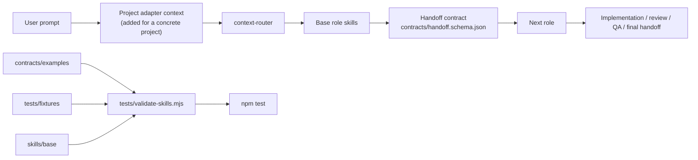
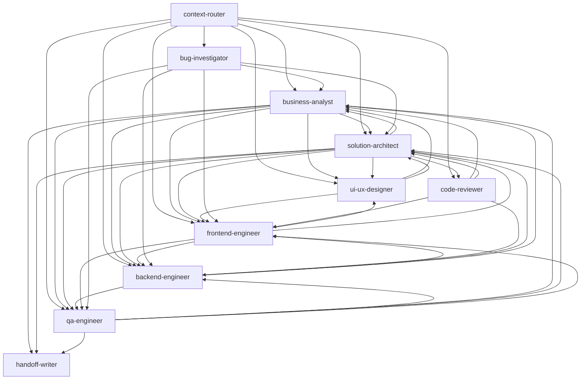
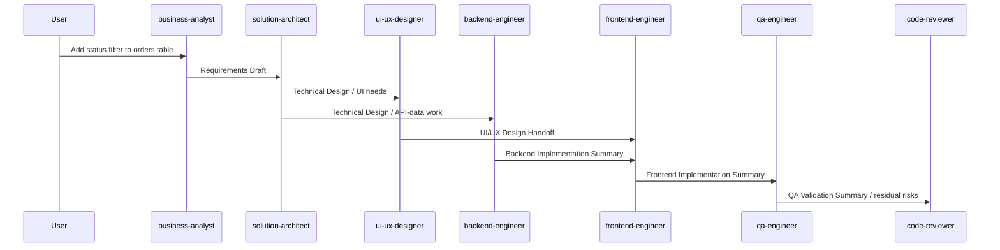
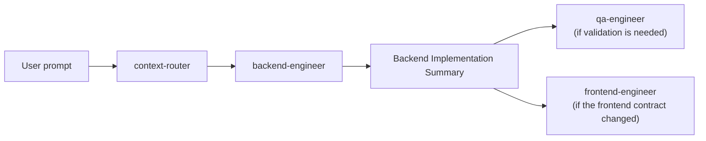
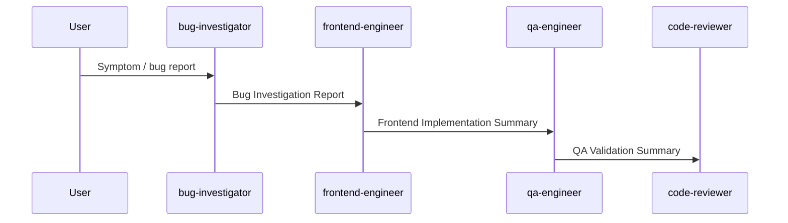
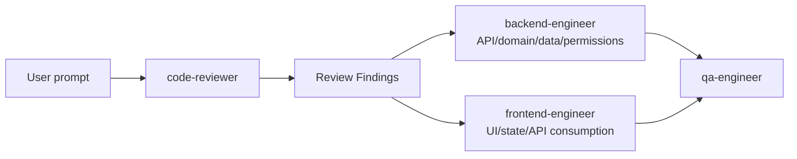
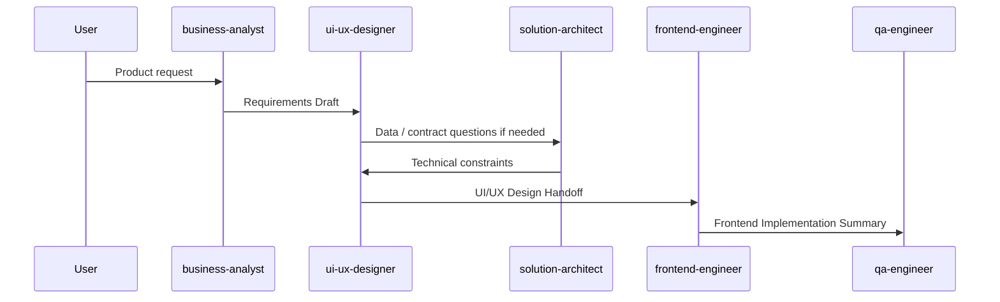
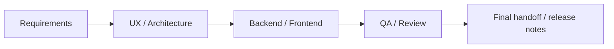
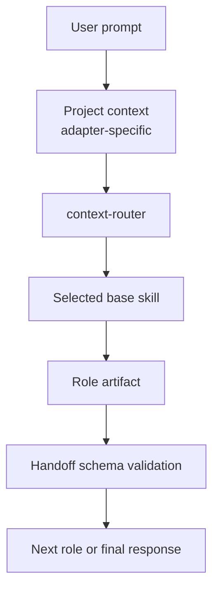

# Creepwave Forge: Base Skill System

A presentation-style document describing the current state of Creepwave Forge: which base skills exist, how they are connected, which artifacts they pass to each other, and which user prompts trigger typical web-application development chains.

## Slide 1. What is already assembled

Creepwave Forge is a base set of role skills for web-application development with verifiable context handoff between roles.

The current version includes:

- 10 base skills in `skills/base/`.
- A shared task handoff format in `contracts/handoff.schema.json`.
- A description of the artifacts that skills pass to each other in `contracts/artifacts.md`.
- Task handoff examples in `contracts/examples/`.
- Test scenarios for typical chains in `tests/fixtures/`.
- Structure and relationship validation in `tests/validate-skills.mjs`.
- Validation command: `npm test`.

## Slide 2. Base role composition

| Skill | Responsibility area |
|---|---|
| `context-router` | Main entry role: receives the task and prepared context, then selects the most suitable next skill |
| `business-analyst` | Understand the task, business rules, scenarios, acceptance criteria, and open questions |
| `solution-architect` | Design the solution across system parts: data, screens, server, risks, and work sequence |
| `ui-ux-designer` | Describe the user journey, screen structure, states, and usability requirements |
| `backend-engineer` | Implement the server side: API, business logic, data, migrations, and tests |
| `frontend-engineer` | Implement the interface: pages, forms, tables, states, API integration, and tests |
| `qa-engineer` | Prepare and run validation: scenarios, regressions, test data, and discovered issues |
| `bug-investigator` | Investigate a bug: reproduce it, gather facts, identify the likely cause, and define the fix path |
| `code-reviewer` | Review changes for bugs, risks, missing checks, and solution clarity |
| `handoff-writer` | Compress and transfer context between roles |

## Slide 3. Overall architecture



Key idea: base skills do not store facts about a concrete project. They define the role, responsibility boundaries, expected output, and rules for passing information forward. Project details arrive later through an adapter.

## Slide 4. Role relationship map



## Slide 5. Shared task handoff format

When one skill passes work to another, it preserves the same field set:

```json
{
  "source_role": "solution-architect",
  "target_role": "backend-engineer",
  "goal": "Add a status filter to the orders list.",
  "scope": "Backend API support for filtering orders by status.",
  "confirmed": [],
  "decisions": [],
  "assumptions": [],
  "open_questions": [],
  "risks": [],
  "artifacts": [],
  "next_action": "Update the orders API and backend tests."
}
```

Why this matters:

- the next skill receives a clear summary, not a random piece of chat history;
- confirmed facts are separated from assumptions;
- unresolved questions do not silently turn into accepted decisions;
- examples and chains can be validated through `npm test`;
- later, this format can power automatic chain execution.

## Slide 6. Typical chain for a multi-part system task

Prompt:

> Add a status filter to the orders table.

If the task is product-shaped or incomplete, the chain looks like this:



Roles by step:

1. `business-analyst` clarifies statuses, user roles, access rights, and acceptance criteria.
2. `solution-architect` decides what must change in data, server, and interface, and identifies risks.
3. `ui-ux-designer` describes how the filter looks and behaves in normal, empty, error, and loading states.
4. `backend-engineer` adds server support if the needed data does not exist yet.
5. `frontend-engineer` builds the interface, connects data, and adds checks.
6. `qa-engineer` validates successful scenarios, errors, edge cases, access rights, and possible regressions.
7. `code-reviewer` checks that contracts between system parts, access rights, tests, and existing behavior are not broken.

## Slide 7. Short route through the router

Prompt:

> In the backend, add a `POST /orders/:id/cancel` endpoint with permission checks and tests.

Even when the task clearly belongs to one area, it still enters through `context-router` first. The router inspects the request and prepared project context. If the task is clear and narrow, it does not start a long chain and passes it directly to the right role.

Likely route:



Why the router selects the short route:

- the user explicitly named the server side;
- the task looks like single-role work;
- there are no signs that business analysis, interface design, or an architectural decision must come first;
- if unclear business rules, access rights, or ownership boundaries appear during implementation, `backend-engineer` routes the task back to `business-analyst` or `solution-architect`.

## Slide 8. Bug-fix chain

Prompt:

> In the customer form, field-level validation errors disappear after a failed submit and retry. Find the cause and fix it.

Typical chain:



If the cause turns out to be server-side, `bug-investigator` passes the task to `backend-engineer` instead of `frontend-engineer`.

## Slide 9. Chain from review to fix

Prompt:

> Review a diff that changes order permissions and route concrete findings to the owner.

Typical chain:



`code-reviewer` does not fix code by default. It writes concrete findings: where the issue is, how severe it is, what confirms it, what may break, how it should be fixed, and which checks are missing. The fix then goes to `backend-engineer` or `frontend-engineer`.

## Slide 10. Chain from interface design to implementation

Prompt:

> Design a screen for bulk order status updates, then prepare it for implementation.

Typical chain:



If business rules and access rights are already clear, the work can start directly with `ui-ux-designer`.

## Slide 11. What is validated now

`npm test` checks that:

- all 10 base skills exist;
- `name` in frontmatter matches the directory;
- every skill has `Purpose`, `Workflow`, `Gotchas`, and `Handoff Contract`;
- every skill describes its expected output;
- `agents/openai.yaml` contains interface metadata;
- role links do not point to unknown base roles;
- 14 required transitions between roles are not broken;
- JSON examples match `contracts/handoff.schema.json`;
- 3 test scenarios contain valid role chains and reference the shared task handoff format.

Current result:

```text
Skill validation passed: 10 base skills, 14 role flows, 2 handoff examples, 3 fixtures.
```

## Slide 12. What this gives V1

For the first version, the system already covers the full web-application development cycle:



V1 strengths:

- roles have clear boundaries;
- routes between roles are understandable;
- task handoff between roles is now verifiable;
- typical chains are already captured by test scenarios;
- the system remains independent from any concrete project and is ready for adapters.

V1 limitations:

- real project facts will arrive later through a concrete project adapter;
- tests currently validate structure and relationships, but do not execute AI responses themselves;
- the automatic chain execution mechanism has not yet been extracted into a separate executable layer.

## Slide 13. How it will be invoked in the product

In the future working flow:



Routing rules:

- an explicit role request invokes that role directly if the task fits;
- server-only or interface-only work goes directly to `backend-engineer` or `frontend-engineer`;
- a task that touches several system parts goes through `solution-architect`;
- an unclear product task goes through `business-analyst`;
- user journeys, screen structure, or interface behavior go through `ui-ux-designer`;
- a bug, failing test, or unclear symptom goes through `bug-investigator`;
- change review or Pull Request review goes through `code-reviewer`;
- a validation plan or result verification goes through `qa-engineer`;
- context transfer between roles is prepared by `handoff-writer`.

## Slide 14. Examples: request -> chain

| User request | Skill chain |
|---|---|
| "Add a status filter to the orders table" | `business-analyst` -> `solution-architect` -> `ui-ux-designer` -> `backend-engineer` -> `frontend-engineer` -> `qa-engineer` -> `code-reviewer` |
| "In the backend, add an order-cancel endpoint with permission checks" | `backend-engineer` -> `qa-engineer` -> `code-reviewer` |
| "Create empty-list, error, and loading states for the customer list" | `frontend-engineer` -> `qa-engineer` |
| "Design a new screen for bulk status updates" | `business-analyst` -> `ui-ux-designer` -> `solution-architect` -> `frontend-engineer` |
| "A test fails intermittently; find the cause" | `bug-investigator` -> `backend-engineer` or `frontend-engineer` -> `qa-engineer` |
| "Review a PR for access-right changes" | `code-reviewer` -> `backend-engineer` or `frontend-engineer` -> `qa-engineer` |
| "Prepare the post-implementation task handoff for QA" | `handoff-writer` -> `qa-engineer` |

## Slide 15. Near-term improvements

The following improvements should come after the base flow is approved:

1. Add project-specific `project-context` to real adapters.
2. Add test scenarios for concrete projects: stack, commands, design system, and validation strategy.
3. Add validation for task handoff examples from real runs.
4. Add an automatic mechanism that selects the role and validates task handoff between steps.
5. Add export to PPTX or HTML deck if this document needs to be presented as a deck.

