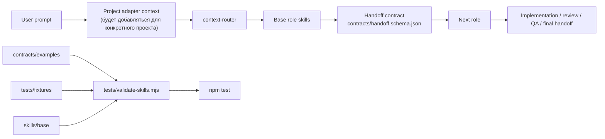
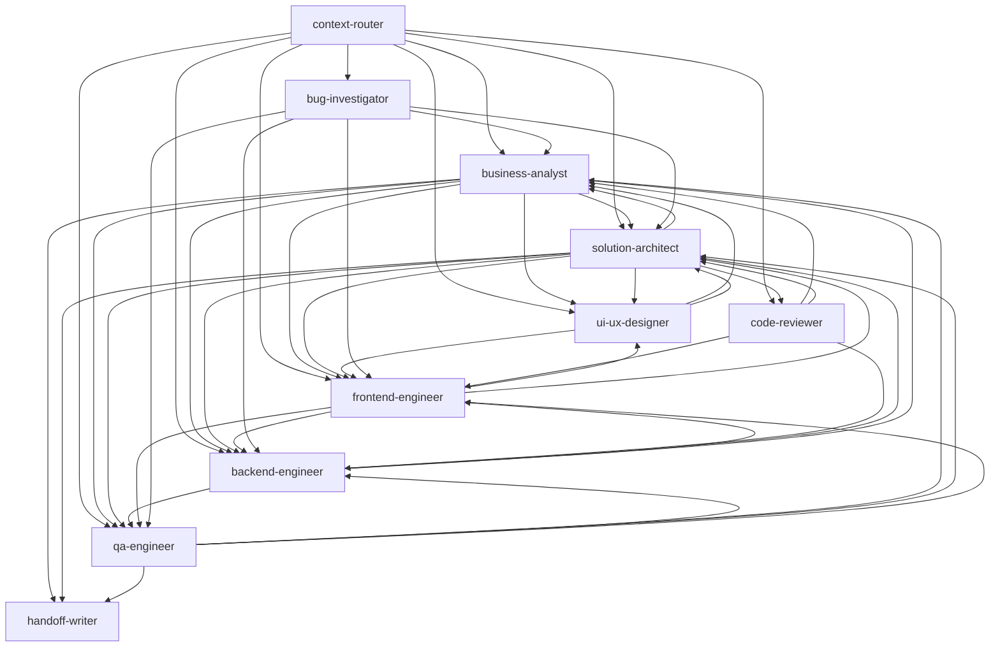
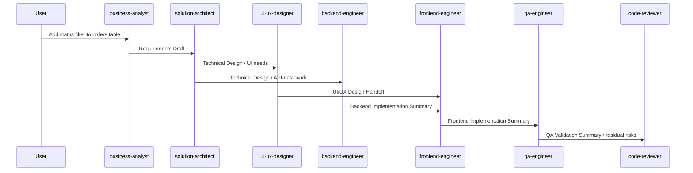
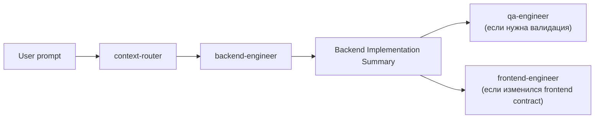
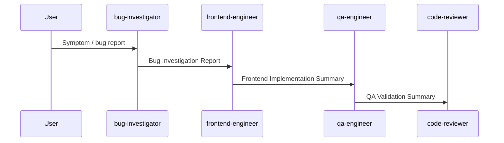
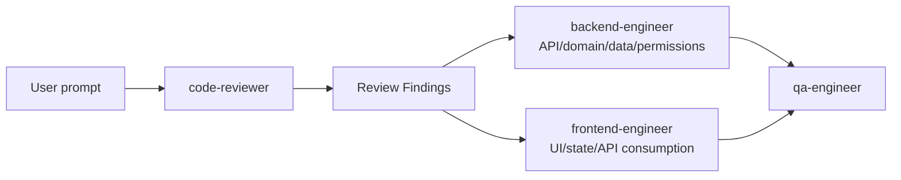
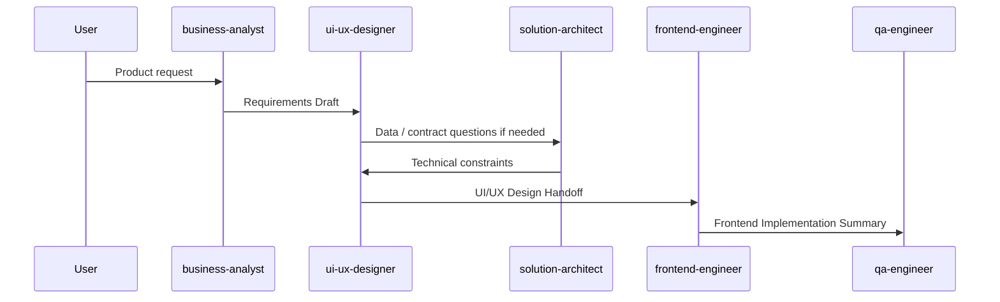
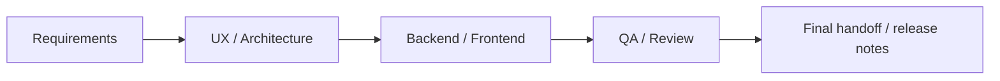
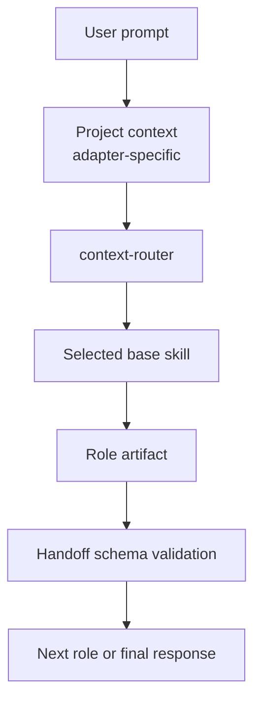

# Creepwave Forge: базовая система скилов

Документ-презентация текущего состояния Creepwave Forge: какие базовые скилы есть, как они связаны, какие артефакты передают друг другу, и какие пользовательские промпты запускают типовые цепочки разработки веб-приложения.

## Слайд 1. Что уже собрано

Creepwave Forge - это базовый набор role skills для разработки веб-приложений с проверяемой передачей контекста между ролями.

В текущей версии есть:

- 10 базовых скилов в `skills/base/`.
- Общий формат передачи задач между скилами в `contracts/handoff.schema.json`.
- Описание результатов, которые скилы передают друг другу, в `contracts/artifacts.md`.
- Примеры передачи задач в `contracts/examples/`.
- Тестовые сценарии типовых цепочек в `tests/fixtures/`.
- Проверка структуры и связей в `tests/validate-skills.mjs`.
- Команда проверки: `npm test`.

## Слайд 2. Состав базовых ролей

| Скил | Зона ответственности |
|---|---|
| `context-router` | Главная входная роль: получает задачу и подготовленный контекст, затем выбирает самый подходящий следующий скил |
| `business-analyst` | Понять задачу, правила бизнеса, сценарии, критерии готовности и открытые вопросы |
| `solution-architect` | Спроектировать решение между частями системы: данные, экраны, сервер, риски и порядок работ |
| `ui-ux-designer` | Описать пользовательский путь, структуру экранов, состояния и требования к удобству |
| `backend-engineer` | Реализовать серверную часть: API, бизнес-логику, данные, миграции и тесты |
| `frontend-engineer` | Реализовать интерфейс: страницы, формы, таблицы, состояния, подключение к API и тесты |
| `qa-engineer` | Подготовить и провести проверку: сценарии, регрессии, тестовые данные, найденные проблемы |
| `bug-investigator` | Разобраться с ошибкой: воспроизвести, собрать факты, понять вероятную причину и путь исправления |
| `code-reviewer` | Проверить изменения на ошибки, риски, недостающие проверки и понятность решения |
| `handoff-writer` | Сжатие и перенос контекста между ролями |

## Слайд 3. Общая архитектура



Ключевая идея: базовые скилы не хранят факты конкретного проекта. Они задают роль, границы ответственности, ожидаемый результат и правила передачи информации дальше. Проектные детали позже приходят через адаптер.

## Слайд 4. Карта связей ролей



## Слайд 5. Единый формат передачи задач

Когда один скил передаёт работу другому, он сохраняет один и тот же набор полей:

```json
{
  "source_role": "solution-architect",
  "target_role": "backend-engineer",
  "goal": "Add a status filter to the orders list.",
  "scope": "Backend API support for filtering orders by status.",
  "confirmed": [],
  "decisions": [],
  "assumptions": [],
  "open_questions": [],
  "risks": [],
  "artifacts": [],
  "next_action": "Update the orders API and backend tests."
}
```

Зачем это нужно:

- следующий скил получает понятное резюме, а не случайный кусок переписки;
- подтверждённые факты отделены от предположений;
- нерешённые вопросы не превращаются незаметно в принятые решения;
- примеры и цепочки можно проверять через `npm test`;
- позже этот формат можно использовать в автоматическом запуске цепочек.

## Слайд 6. Типовая цепочка для задачи на несколько частей системы

Промпт:

> Добавь фильтр по статусу в таблицу заказов.

Если задача задана как продуктовая или неполная, цепочка выглядит так:



Роли по шагам:

1. `business-analyst` уточняет статусы, роли пользователей, права доступа и критерии готовности.
2. `solution-architect` решает, что нужно изменить в данных, сервере и интерфейсе, и какие есть риски.
3. `ui-ux-designer` описывает, как фильтр выглядит и ведёт себя в обычном, пустом, ошибочном и загрузочном состояниях.
4. `backend-engineer` добавляет серверную поддержку, если нужных данных ещё нет.
5. `frontend-engineer` делает интерфейс, подключает данные и добавляет проверки.
6. `qa-engineer` проверяет успешные сценарии, ошибки, граничные случаи, права доступа и возможные регрессии.
7. `code-reviewer` проверяет, не сломаны ли договорённости между частями системы, права доступа, тесты и уже существующее поведение.

## Слайд 7. Короткий маршрут через router

Промпт:

> В backend добавь endpoint `POST /orders/:id/cancel` с проверкой прав и тестами.

Даже если задача явно относится к одной области, она всё равно сначала попадает в `context-router`. Router смотрит на запрос и подготовленный контекст проекта. Если задача понятная и узкая, он не запускает длинную цепочку, а сразу передаёт её в нужную роль.

Вероятный маршрут:



Почему router выбирает короткий маршрут:

- пользователь явно указал серверную часть;
- задача выглядит как работа одной роли;
- нет признаков, что сначала нужен бизнес-анализ, дизайн интерфейса или архитектурное решение;
- если в процессе выяснится, что неясны правила бизнеса, права доступа или зона ответственности, `backend-engineer` вернёт задачу к `business-analyst` или `solution-architect`.

## Слайд 8. Цепочка исправления ошибки

Промпт:

> В форме клиента после failed submit и retry исчезают field-level validation errors. Найди причину и исправь.

Типовая цепочка:



Если причина окажется в серверной части, `bug-investigator` передаст задачу в `backend-engineer` вместо `frontend-engineer`.

## Слайд 9. Цепочка от ревью к исправлению

Промпт:

> Проведи ревью diff, который меняет права на заказы, и направь конкретные findings владельцу.

Типовая цепочка:



`code-reviewer` не исправляет код по умолчанию. Он формулирует конкретные замечания: где проблема, насколько она серьёзная, чем подтверждается, что может сломаться, как это лучше исправить и каких проверок не хватает. Дальше исправление уходит к `backend-engineer` или `frontend-engineer`.

## Слайд 10. Цепочка от проектирования интерфейса к реализации

Промпт:

> Спроектируй экран массового обновления статусов заказов, потом подготовь это к реализации.

Типовая цепочка:



Если бизнес-правила и права уже ясны, можно стартовать сразу с `ui-ux-designer`.

## Слайд 11. Что валидируется сейчас

`npm test` проверяет:

- все 10 базовых скилов существуют;
- `name` в frontmatter совпадает с директорией;
- у каждого скила есть `Purpose`, `Workflow`, `Gotchas`, `Handoff Contract`;
- у каждого скила описан ожидаемый результат;
- `agents/openai.yaml` содержит interface metadata;
- role links не указывают на неизвестные базовые роли;
- 14 обязательных переходов между ролями не обрываются;
- JSON examples соответствуют `contracts/handoff.schema.json`;
- 3 тестовых сценария содержат валидные цепочки ролей и ссылаются на общий формат передачи задач.

Текущий результат:

```text
Skill validation passed: 10 base skills, 14 role flows, 2 handoff examples, 3 fixtures.
```

## Слайд 12. Что это даёт для V1

Для первой версии система уже покрывает полный цикл разработки веб-приложения:



Сильные стороны V1:

- роли имеют чёткие границы;
- есть понятные маршруты между ролями;
- передача задач между ролями стала проверяемой;
- типовые цепочки уже зафиксированы тестовыми сценариями;
- система остаётся независимой от конкретного проекта и готова к адаптерам.

Ограничения V1:

- реальные проектные факты появятся позже через адаптер конкретного проекта;
- тесты пока проверяют структуру и связи, но не запускают сами ответы ИИ;
- автоматический механизм запуска цепочек пока не вынесен в отдельный исполняемый слой.

## Слайд 13. Как будет вызываться в продукте

В будущей рабочей схеме:



Правило маршрутизации:

- явный запрос роли вызывает эту роль напрямую, если задача подходит;
- задача только по серверной или только по интерфейсной части идёт сразу в `backend-engineer` или `frontend-engineer`;
- задача, которая затрагивает несколько частей системы, идёт через `solution-architect`;
- неясная продуктовая задача идёт через `business-analyst`;
- пользовательский путь, структура экрана или поведение интерфейса идут через `ui-ux-designer`;
- ошибка, падающий тест или непонятный симптом идут через `bug-investigator`;
- проверка изменений или Pull Request идёт через `code-reviewer`;
- план проверки или проверка результата идут через `qa-engineer`;
- перенос контекста между ролями оформляет `handoff-writer`.

## Слайд 14. Примеры: запрос -> цепочка

| Запрос пользователя | Цепочка скилов |
|---|---|
| "Добавь фильтр по статусу в таблицу заказов" | `business-analyst` -> `solution-architect` -> `ui-ux-designer` -> `backend-engineer` -> `frontend-engineer` -> `qa-engineer` -> `code-reviewer` |
| "В backend добавь endpoint отмены заказа с проверкой прав" | `backend-engineer` -> `qa-engineer` -> `code-reviewer` |
| "Сделай состояния пустого списка, ошибки и загрузки для списка клиентов" | `frontend-engineer` -> `qa-engineer` |
| "Спроектируй новый экран массового обновления статусов" | `business-analyst` -> `ui-ux-designer` -> `solution-architect` -> `frontend-engineer` |
| "Тест иногда падает, найди причину" | `bug-investigator` -> `backend-engineer` или `frontend-engineer` -> `qa-engineer` |
| "Проведи ревью PR по правам доступа" | `code-reviewer` -> `backend-engineer` или `frontend-engineer` -> `qa-engineer` |
| "Собери передачу задачи после реализации для QA" | `handoff-writer` -> `qa-engineer` |

## Слайд 15. Ближайшие улучшения

Следующие улучшения стоит делать после утверждения базовой схемы:

1. Добавить project-specific `project-context` в реальные adapters.
2. Добавить тестовые сценарии для конкретных проектов: стек, команды, дизайн-система, стратегия проверки.
3. Добавить проверку примеров передачи задач из реальных прогонов.
4. Добавить автоматический механизм, который будет выбирать роль и проверять передачу задачи между шагами.
5. Добавить export в PPTX или HTML-deck, если этот документ нужно показывать как презентацию.
